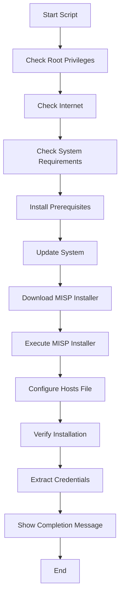

# MISP Automated Installation Script

This project provides an automated Bash script to install and configure [MISP](https://www.misp-project.org/) (Malware Information Sharing Platform & Threat Sharing) on **Ubuntu 24.04 LTS**. The script ensures a smooth, error-handled, and repeatable deployment of MISP, including system checks, prerequisites, firewall configuration, and post-installation verification.

## Features
- Strict error handling and logging
- System requirement checks (disk, memory, CPU, OS)
- Prerequisite package installation
- Firewall configuration
- Automated download and execution of the official MISP installer
- Post-installation verification and credential extraction
- Comprehensive logging and credential output

## Usage
1. **Clone or download this repository.**
2. **Run the script as root on Ubuntu 24.04 LTS:**
   ```bash
   sudo bash misp_config.sh
   ```
3. **Follow the on-screen instructions.**
4. **After installation, credentials and access URLs will be provided.**

## Output
- **Credentials:** `/root/misp_credentials.txt`
- **Installation Log:** `/var/log/misp-installer/misp_install_<timestamp>.log`

## Workflow Architecture



## License
See [LICENSE](LICENSE) for details.

## Future Implementation

Support for additional Linux distributions is planned, including:
- **Kali Linux**: Automated MISP installation and configuration tailored for penetration testing environments.
- **Other Linux Distributions**: Scripts and instructions for distributions such as Debian, CentOS, and Fedora.

These enhancements will provide broader compatibility and make MISP deployment easier across various security and research platforms.

## Author
- MrAashish0x1
